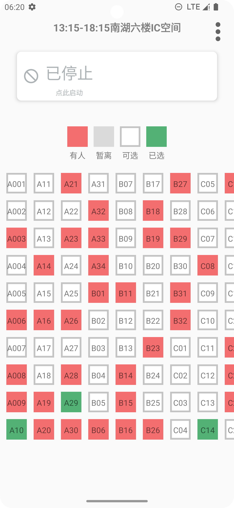
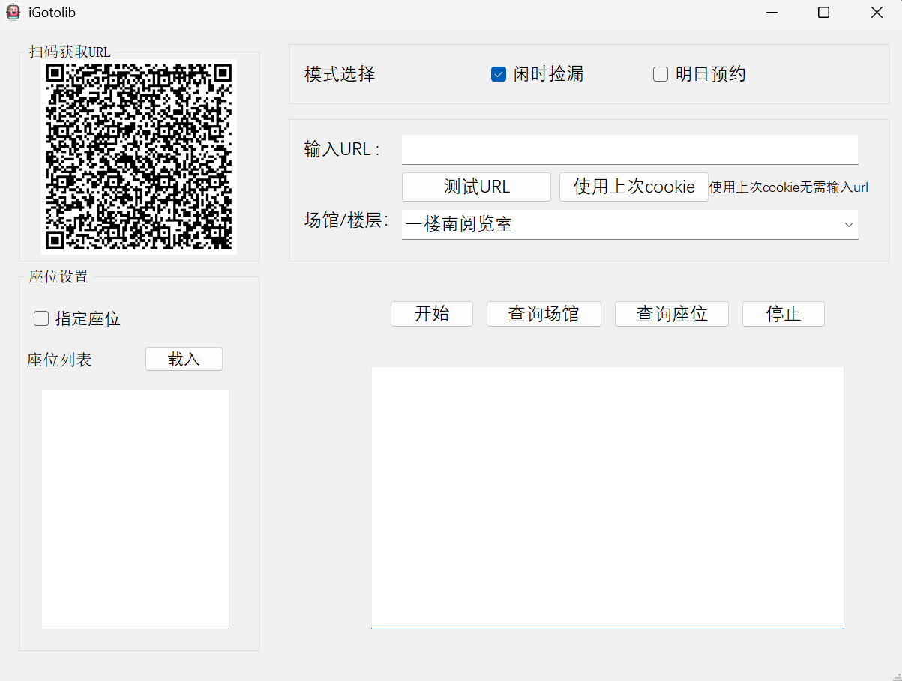

# iGotolib

我去图书馆抢座软件，支持所有使用我去图书馆平台预约的学校

目前有Windows版与安卓版，强烈推荐使用安卓版，功能更多、更方便

  
 

## 功能介绍

### 今日预约
- 自动蹲守，闲时捡漏

### 明日预约
- 自动排队，卡点预约

### 手动选座
- 纯手动选座
- 
### 其他功能
- 支持指定座位，支持座位记忆功能
- 支持每日自动获取积分
- 支持软件内退座
- 支持Cookie自动维持有效
- 支持自定义抢座参数，如刷新频率、排队请求频率等

## 教程

[金山文档 | WPS云文档 手把手教程](https://kdocs.cn/l/cs0WC8brESTz)

## 下载链接

- **百度网盘**  
  [https://pan.baidu.com/s/14-kKMT5BaNfhX9n27YLZXA?pwd=x9dx](https://pan.baidu.com/s/14-kKMT5BaNfhX9n27YLZXA?pwd=x9dx)

- **123网盘（不限速，无需登录）**  
  [https://www.123865.com/s/U9Rcjv-1z5rv](https://www.123865.com/s/U9Rcjv-1z5rv)
